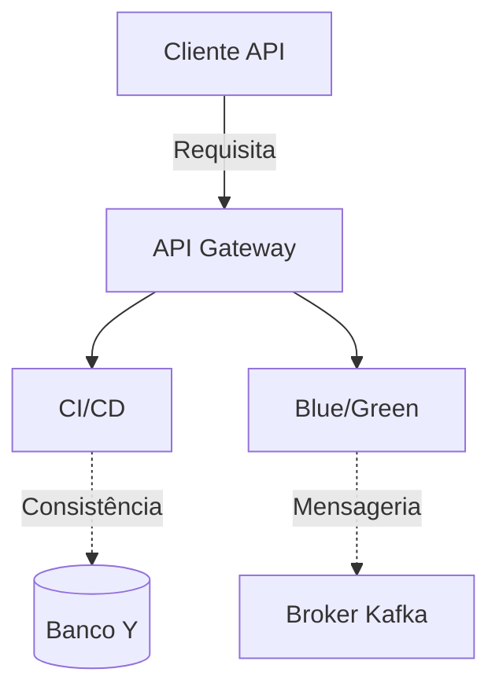

# 🌐 Aula 12 - Deploy e DevOps

!!! tip "Objetivo"
    **Objetivo:** Explorar a fundo os conceitos de Deploy e DevOps, abordando CI/CD, Blue/Green, Canary e Feature Flags. Construiremos uma base teórica e prática com diagramas, comandos interativos e matemática aplicada à ciência da computação.

---

## 1. Visão Geral Teórica 🧠

O estudo de **CI/CD** e **Blue/Green** é fundamental para sistemas de alta disponibilidade.

!!! info "Definição Técnica"
    Aplicações cloud-native exigem tolerância a falhas. Segundo o Teorema CAP, não podemos ter Consistência, Disponibilidade e Partição simultaneamente em sistemas distribuídos.

Quando lidamos com *Deploy e DevOps*, a performance pode ser modelada através da Lei de Amdahl:
$$ S_{latency}(s) = \frac{1}{(1 - p) + \frac{p}{s}} $$
Onde $p$ é a porção paralelizável.

---

## 2. Arquitetura e Modelagem 📊

Abaixo, a representação de como CI/CD é adotado em escala industrial.



### 2.1 Comparativo de Tecnologias

=== "Abordagem A"
    Focada em **Canary**. Maior curva de aprendizado, porém mais controle sobre o I/O.
=== "Abordagem B"
    Focada em **Feature Flags**. Mais rápida para o mercado (Time-to-Market).

---

## 3. Prática: Hands-on em `Canary` 💻

Vamos subir nosso ambiente local para explorar as particularidades tecnológicas de `Deploy e DevOps`.

```termynal
$ docker network create backend_net
$ docker run -d --name canary_svc -p 8080:8080 my-backend-image
# Inicializando o servidor...
[OK] Service started on port 8080.
```

### Analisando o Código fonte

```python title="main.py"
def processar_requisicao(payload):
    # (1) Validar contrato da API
    if not isinstance(payload, dict):
        raise ValueError("Invalid format")  
    return {"status": "success", "data": payload}
```

1.  A validação antecipada (*fail-fast*) evita perda de processamento em camadas mais profundas.

---

## 🔗 Materiais da Aula

<div class="grid cards" markdown>
- :material-presentation: **Slides**

    ---

    Material visual com diagramas e conceitos-chave.

    [:octicons-arrow-right-24: Slide 12](../slides/slide-12.html)

- :material-help-circle: **Quiz**

    ---

    Teste seu conhecimento com 10 questões interativas.

    [:octicons-arrow-right-24: Quiz 12](../quizzes/quiz-12.md)

- :fontawesome-solid-pencil: **Exercícios**

    ---

    5 exercícios progressivos (básico → desafio).

    [:octicons-arrow-right-24: Exercício 12](../exercicios/exercicio-12.md)

- :material-briefcase-outline: **Projeto**

    ---

    Aplicação prática dos conceitos da aula.

    [:octicons-arrow-right-24: Projeto 12](../projetos/projeto-12.md)

</div>

---

[➡️ Próxima Aula: Serverless e Edge](./aula-13.md){ .md-button .md-button--primary }