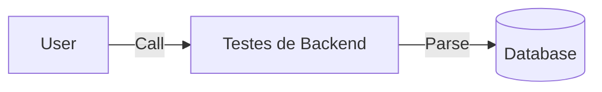

# Módulo 11
## Testes de Backend
<br>
Aprofundamento na Engenharia Cloud-Native

---

## A Importância de Testes de Backend 📈

- Base para sistemas de milhões de acessos. <!-- .element: class="fragment" -->
- Substitui práticas engessadas do legado. <!-- .element: class="fragment" -->
- Padroniza o fluxo de entrega. <!-- .element: class="fragment" -->

---

## 1. O que é Testes Unitários? 🧩

Um divisor de águas na arquitetura.

- Separação real de contexto. <!-- .element: class="fragment" -->
- Independência de deploy. <!-- .element: class="fragment" -->

--

### Exemplificando 🛠️

```python
import backend

def render():
    return backend.scale_up()
```

---

## 2. Abordando Postman 📊



---

## Matemática Aplicada 🔢

As métricas de resposta provam que:
$$ O(log N) $$
Traz mais consistência do que buscas lineares sob estresse da rede.

---

## Aprofundando em Pact e K6 🚢

- **Pact**: Reduz o acoplamento temporal. <!-- .element: class="fragment" -->
- **K6**: Garante que o estado seja imutável a longo prazo. <!-- .element: class="fragment" -->

---

## Resumo e Próximos Passos ✅

- A base de **Testes de Backend** é sólida. <!-- .element: class="fragment" -->
- Apliquem este fluxo aos **Projetos Práticos**. <!-- .element: class="fragment" -->

> "O código que você escreve hoje moldará o sistema de amanhã."
